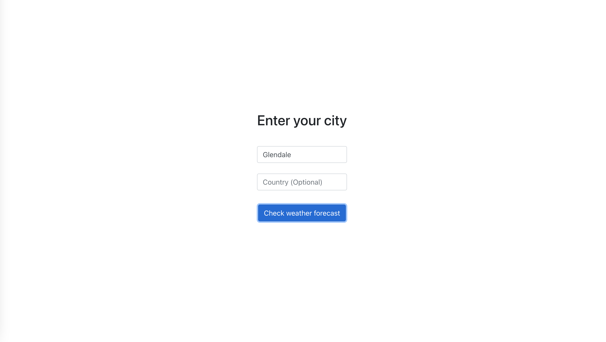

# React Weather App

This is a project constructed around the React.js framework using a Weather API from OpenWeatherMap. I used Create-React-App along with React-Bootstrap to create the app interface. In the future, I have found success using Gatsby.js (a React framework) which I would do so if I were to create this app over again.

## Table of contents
- [Overview](#overview)
  - [Links](#links)
- [My process](#my-process)
  - [Built with](#built-with)
  - [What I learned](#what-i-learned)
  <!-- - [Continued development](#continued-development) -->
  - [Useful resources](#useful-resources)
<!-- - [Author](#author)
- [Acknowledgments](#acknowledgments) -->

## Overview


### Links
- [Active Link](https://marjoree-react-5day-forecast-app.netlify.app/)
- [Repository](https://github.com/mfargas/weather-app.git)

## My Process
### Built With
I started with Create React App then installed dependencies React-Bootstrap, React-Geocode, and configure an OpenWeatherMap API key.

To start, I used Create-React-App as follows:

```
  npm create-react-app
```
importing the following dependencies
```
  npm i dotenv react-bootstrap react-geocode
```
followed by
```
  npm run start
```

#### May 2022
*I updated this and was able to find a free OpenWeatherMap API url that pulls data when you search a city. Initially I was using a url that called for latitude and longitude, for that reason I downloaded React-Geocode to my package.json. I may used that package library in the 
future, perhaps to create a GeoLocation button to get the user's precise
latitude and longitude coordinates for a more personalized search.*

**I would instead start with the following**
```
  npm init gatsby
```
```
  npm i dotenv react-bootstrap
```
```
  gatsby develop
```

I have found the Create-React-App has recently accumulated dependency issues, specifically with incompatibility with updates to react-script. This is something I am looking further into, however I have found that Gatsby has been a great starting point for my other React.js projects.

#### API Implementation

To call the  API I choose to use 


I would be utilizing the first API Call with a .env file containing my data for development mode. The city would be attained through an asynchronous function that uses data from an entry form to be used for a full API call.


For production, I used this same data and applied them as Variables within the Deployment Configuration settings. I used Netlify and for Deployment, they allow you to set this data so as not to expose your API keys online.

I would apply the information from my dotenv or Deployment variables using

```
process.env.VARIABLE
```
as such:


When Fetching the data, I used a separated function within the hooks folder I created. Since I decided to no longer fetch data using Latitude and Longitude, I have deactivated any responses calling to 

```
import { useState, useEffect } from 'react'

const UseFetch = (initialUrl) => {
    // create state variables
    const [data, setData] = useState(null)
    const [error, setError] = useState(null)
    const [isLoading, setIsLoading] = useState(null)
    const [url, setUrl] = useState(initialUrl)

    useEffect(() => {

        if (!url) return
        setIsLoading(true)

        // clear previous search
        setData(null)
        setError(null)

        fetch(url)
            .then((response) => response.json())
            .then((data) => {
                setIsLoading(false);
                if (data.cod >= 400) {
                    setError(data.message);
                    return;
                }
                setData(data);
            })
            .catch((error) => {
                setIsLoading(false);
                setError(error);
            });

        // dependency array 
    }, [url]);

    return { data, error, isLoading, setUrl };
};

export default UseFetch;
```
The Fetch function utilizes the useState and useEffect functions useful in React applications to manage the state of the data retrieved from the API Call and updates the data when a second call is made by the user.

When the information is attained through the Fetch function within the hooks folder, the following information would be accessed under 'data'


Within the CitySelector function, there is a form the user can use to enter data as follows:
```
<Row>
    <Col xs={14}>
      <FormControl
          placeholder="Enter your city"
          onChange={(event) => setCity(event.target.value)}
          value={city}
          onKeyDown={onKeyDown}
      />
      <br/>
      <FormControl
          placeholder="Country (Optional)"
          onChange={(event) => setState(event.target.value)}
          value={state}
          onKeyDown={onKeyDown}
      />
    </Col>
</Row>
<Row>
    <Col>
        <Button onClick={() => onSearch(city, state)}>Check weather forecast</Button>
    </Col>
</Row>
```

Above the return section of the function, state is called for in order to track the data that is being typed within the Form Entry fields.
```
const onKeyDown = (event) => {
        if (event.keyCode === 13) {
            onSearch()
        }

        console.log(city)
        console.log(state)
    };
```

The CitySelector function takes in onSearch as a property when CitySelector is imported to App.js, which awaits the response from the Form Entries before searching.
```
<CitySelector onSearch={(city, state) => setUrl(`${REACT_APP_API_BASE_URL}data/2.5/forecast?q=${city},${state}&appid=${REACT_APP_API_KEY}`)} >
</CitySelector>
```

Using ${} surrounded by backtick marks would allow the variable within it to be replaced by whatever your variable stands for. The API Key and Base Url are taken from my configuration settings (.env in development and variable keys within development environment) while the City and Country are taken from our CitySelector component.
**I realize I use State in my code when the data would ask for Country**

I created a WeatherList component to hold the various WeatherCards that would take in the following data using the React-Bootstrap Card component
```
///Weather Card

<Card>
    <Card.Img variant="top" src={`http://openweathermap.org/img/wn/${icon}@2x.png`} />
    <Card.Body>
      <Card.Title>{main}</Card.Title>
        <p>{date.toLocaleDateString()} - {date.toLocaleTimeString([], { hour: '2-digit', minute: '2-digit' })}</p>
        <p>Temp: {temp}{'\u00B0'}F</p>
    </Card.Body>
</Card>
```
```
<Row>
    <Col>
      <h1>{name}</h1>
    </Col>
</Row>
<Row>
    {list.map(({ dt, main, weather }) => (
    <Col key={dt}>
      <WeatherCard
        temp={Math.round((main.temp - 273)*1.8)+ 32}
        dt={dt * 1000}
        main={weather[0].main}
        icon={weather[0].icon}
      />
    </Col>))}
</Row>
```

You will notice I converted the temperature data within the temp property of the WeatherCard to convert the default Kelvin temperature data into Fahrenheit.

The {'\u00B0'}F is used to generate a degree symbol to demonstrate it is in degrees Fahrenheit.

### What I Learned
#### Hooks and Fetching Data
I learned to make API calls in the context of a React App, and learned the importance of placement in an API call to avoid unnecessary 
calls.

I learned how to utilize data further within the components of a React app and how to manipulate the data. I have a lot more to learn but this is just the start and a great project to get started with React.js.

As mentioned before, I would use Gatsby.js as Create-React-App has been a bit buggy and from documentation online, it seems to be an issue with compatibility with the new react-scripts update.

### Useful Resources
- [OpenWeatherMaps API](https://openweathermap.org/forecast5)
- [React Hooks FAQ](https://reactjs.org/docs/hooks-faq.html)
- [Create React App + Troubleshooting](https://create-react-app.dev/docs/troubleshooting/)
- [Gatsby for Future Development](https://www.gatsbyjs.com/docs)
