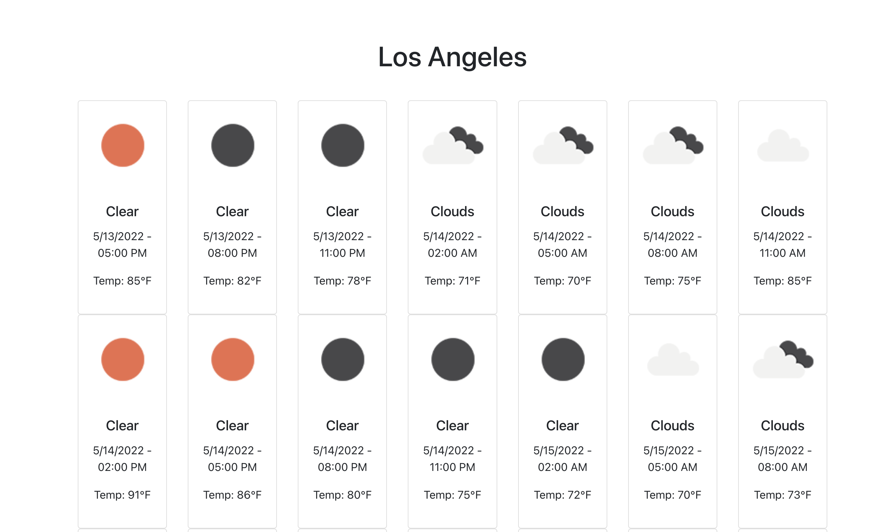

# React Weather App

This is a project constructed around the React.js framework using a Weather API from OpenWeatherMap.

## Table of contents
- [Overview](#overview)
  - [Idea](#idea)
  - [Screenshot](#screenshot)
  - [Links](#links)
- [My process](#my-process)
  - [Built with](#built-with)
  - [What I learned](#what-i-learned)
  <!-- - [Continued development](#continued-development) -->
  - [Useful resources](#useful-resources)
<!-- - [Author](#author)
- [Acknowledgments](#acknowledgments) -->

## Overview

### Idea
This is a project with a basic implementation of React.js and APIs. At UCSB Fall 2017, I built an app using mapbox API to
show on a map where a nearby fire would be. I actually got it to work... only I was building it when the Thomas Fire affected the
area. While we faced many challenges as classmates and neighbors within the community, I was building this app with a first-hand
experience testing my own product out in my own situation. It wasn't very advanced, but it was a very surreal moment for me. I am
now building this Weather Forecasting app to do one simple thing using React to change from my use of Vanilla JavaScript (pre ES6)
on the Fire App.

### Screenshot

<!-- ### Links -->

## My Process
### Built With
I started with Create React App then installed dependencies React-Bootstrap, React-Geocode, and configure an OpenWeatherMap API key.

May 2022
I updated this and was able to find a free OpenWeatherMap API url that pulls data when you search a city. Initially I was using a url that called for latitude and longitude, for that reason I downloaded React-Geocode to my package.json. I may used that package library in the 
future, perhaps to create a GeoLocation button to get the user's precise
latitude and longitude coordinates for a more personalized search.

### What I Learned
I learned to make API calls in the context of a React App, and learned the importance of placement in an API call to avoid unnecessary 
calls.